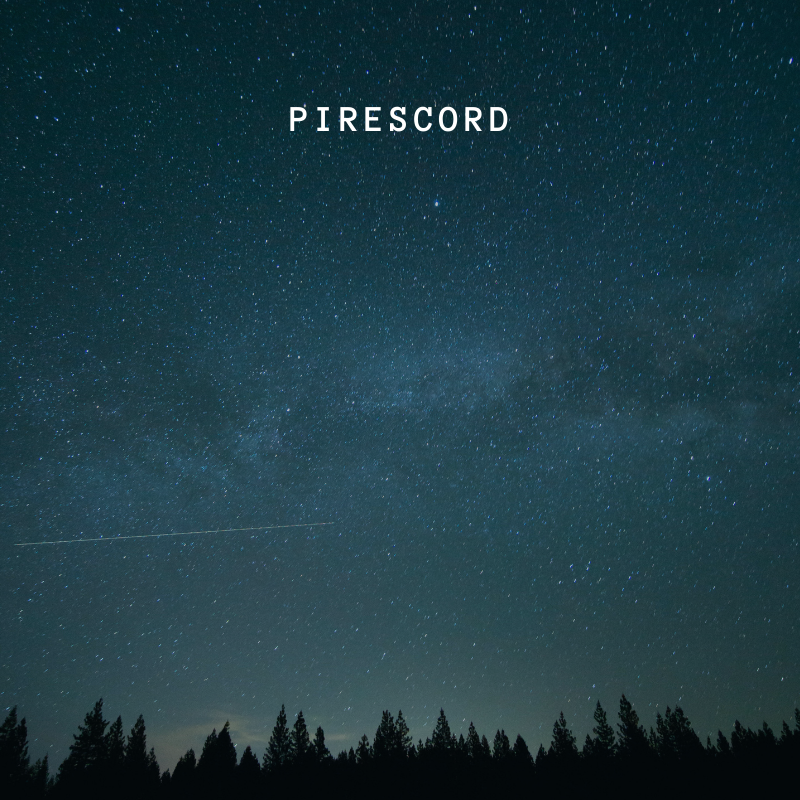
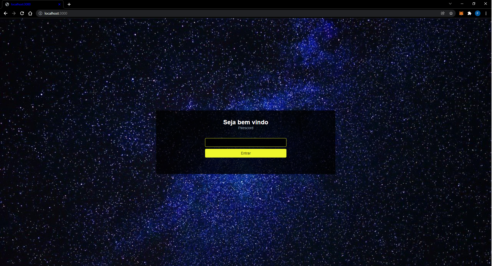
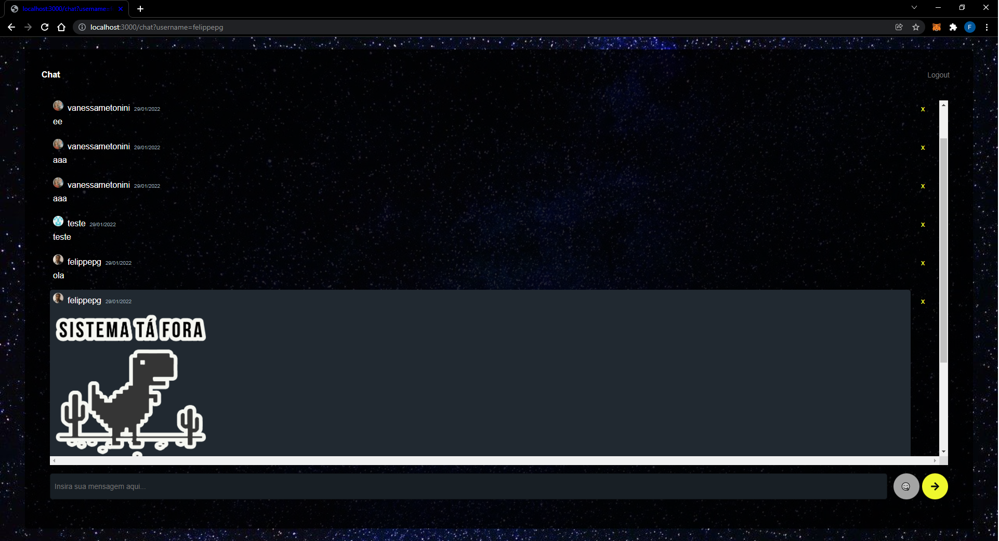

# PIRESCORD

<h1 align="center">
    
</h1>

## Descrição do Projeto
O projeto é um chat em tempo real desenvolvido na Imersão React da [Alura](https://www.alura.com.br/), utilizando [Next.js](https://nextjs.org/)
juntamente com o [Supabase](https://supabase.com/) como backend as a service

### Pré-requisitos

Antes de começar, você vai precisar ter instalado em sua máquina as seguintes ferramentas:
[Git](https://git-scm.com). 
Além disto é bom ter um editor para trabalhar com o código como [VSCode](https://code.visualstudio.com/)

### 🎲 Rodando a Projeto

```bash
# Clone este repositório
$ git clone <https://github.com/felippepg/pirescord>

# Acesse a pasta do projeto no terminal/cmd
$ cd pirescord

# Baixar todas as dependencias necessárias para rodar o projeto
$ yarn OU npm install (dependendo do seu gerenciador de pacotes)

# Para iniciar o projeto em modo de desenvolvedor 
$ yarn dev ou npm run dev
```


### :pushpin:	Home

<h1 align="center">
    
</h1>

### :pushpin:	Chat

<h1 align="center">
    
</h1>

## 🛠 Tecnologias

As seguintes tecnologias foram usadas na construção da API:

- [REACT.JS](https://pt-br.reactjs.org/)
- [NEXT.JS](https://nextjs.org/)
- [SUPABASE](https://supabase.com/)
- [SKYNEX-UI](https://github.com/skynexui)


## Features

- [x] Login com informações do Github
- [x] Chat em tempo real

